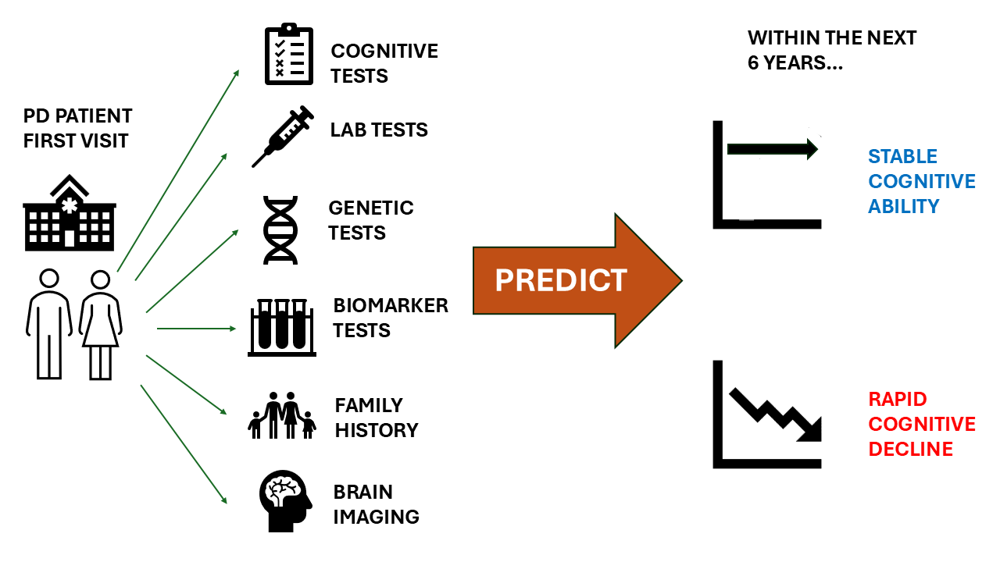

This aim of this project is to predict neurocognitive decline of patients diagnosed with Parkinson's Disease, utilizing their genetic, clinical, demographic and imageing records. The data is sourced from the PPMI initiative, and analyzed for a Master's Degree Project. 

Cognitive impairment is a common symptom of Parkinson’s disease (PD), with patients experiencing varying levels of severity depending on the stage and progression of the
disease. The goal of this project is to predict whether a patient with PD and alpha-synuclein pathology -a biological marker associated with the disease, would experience 
rapid versus normal cognitive decline using data from the Parkinson’s Progression Markers Initiative database. We analyzed cognitive assessment scores over time and fitted a 
linear regression model to classify each patient as rapid or steady decliners based on their rate of deterioration. We then trained an XGBoost classification machine learning 
model using these labels to predict which patients would fall into which categories. From this, we gained significant insights into key predictors of rapid cognitive decline 
for patients with PD, including clinical, biological, and brain imaging measures, providing insights that could help identify at-risk patients earlier in their disease 
progression.
